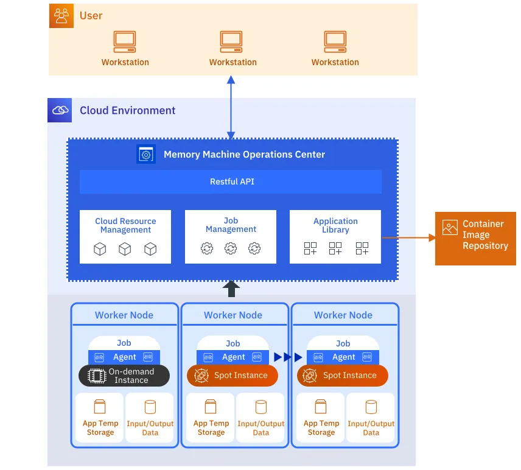
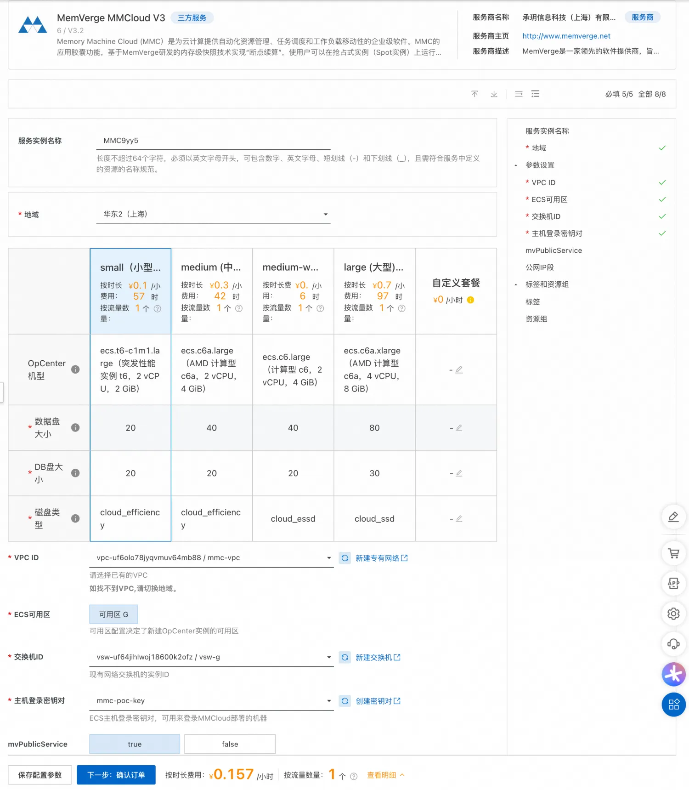
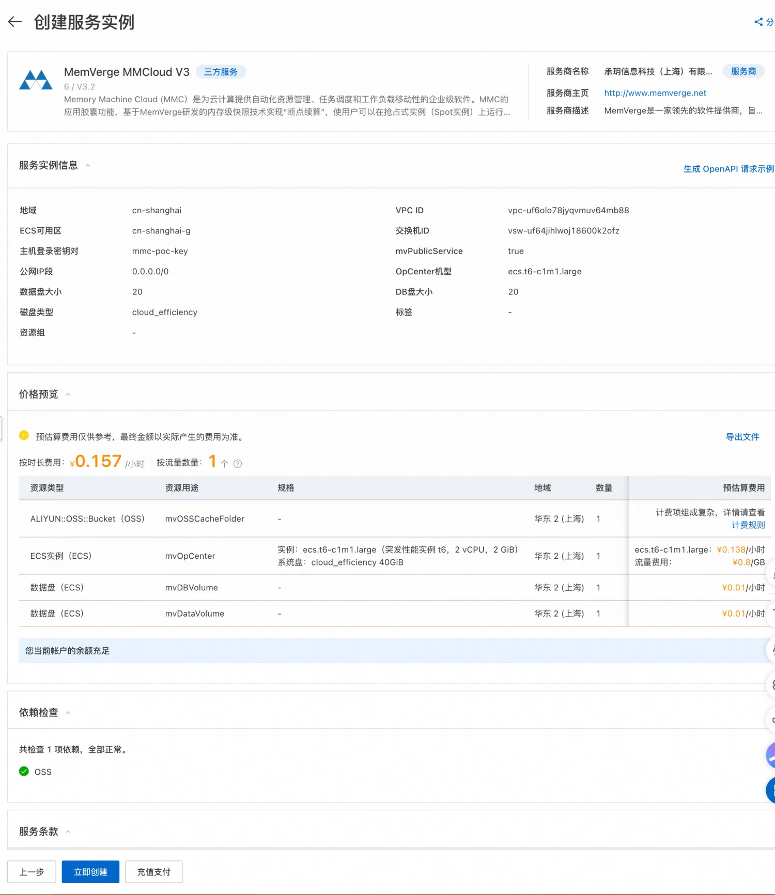
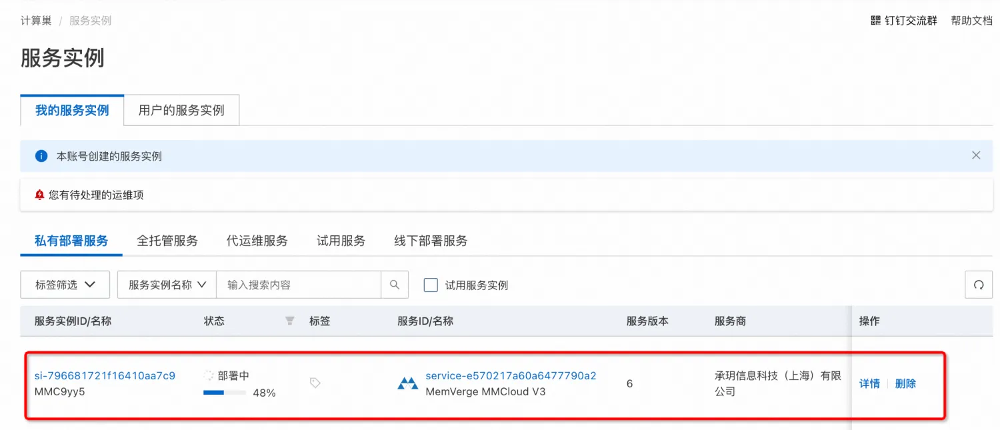
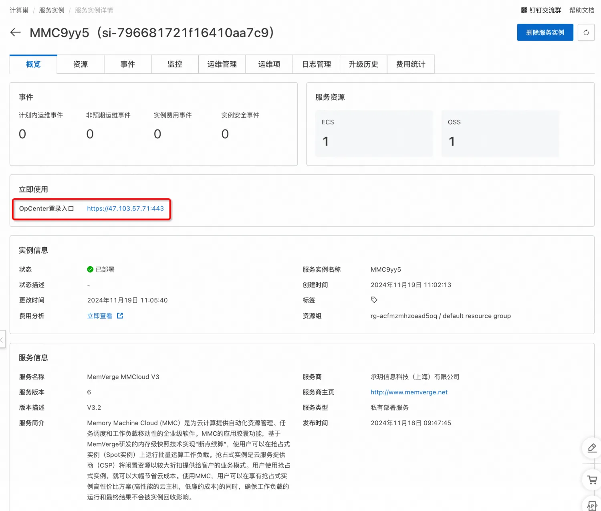
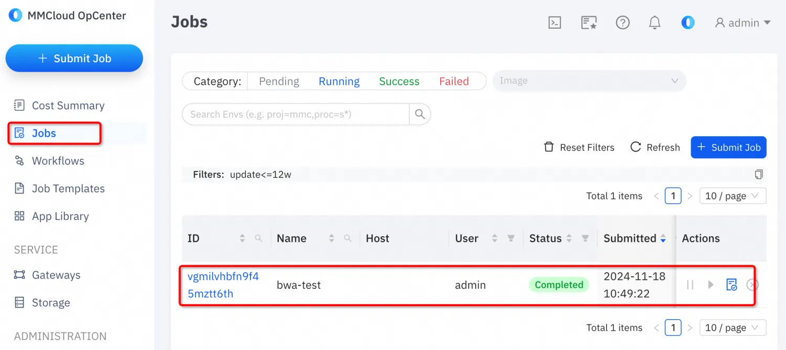
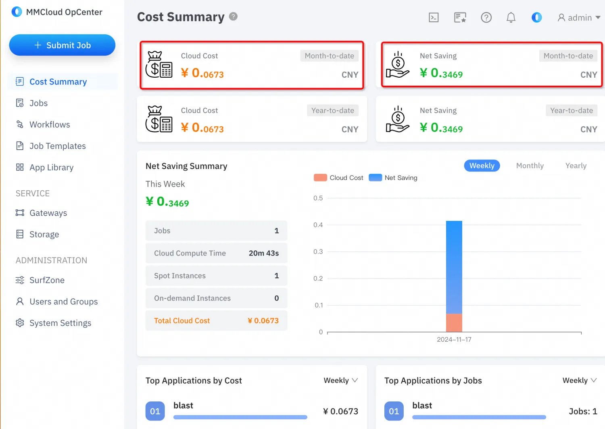

# memverge 部署文档
## 概述
Memory Machine Cloud(MMC)为公有云用户提供更加简单、高效、省钱的云平台解决方案，基于WaveRider智能选配云主机和SpotSurfer断点续算两大核心能力实现云成本降低70%，性能提升50%。

本文档介绍基于计算巢如何快速部署并使用MMC。
## 前提条件

部署MMC实例服务实例，需要对部分阿里云资源进行访问和创建操作。因此您的账号需要包含如下资源的权限。 说明：当您的账号是RAM账号时，才需要添加此权限。

| <font style="color:rgb(51, 51, 51);">权限策略名称</font> | <font style="color:rgb(51, 51, 51);">备注</font> |
| --- | --- |
| <font style="color:rgb(51, 51, 51);">AliyunECSFullAccess</font> | <font style="color:rgb(51, 51, 51);">管理云服务器服务（ECS）的权限</font> |
| <font style="color:rgb(51, 51, 51);">AliyunROSFullAccess</font> | <font style="color:rgb(51, 51, 51);">管理资源编排服务（ROS）的权限</font> |
| <font style="color:rgb(51, 51, 51);">AliyunComputeNestUserFullAccess</font> | <font style="color:rgb(51, 51, 51);">管理计算巢服务（ComputeNest）的用户侧权限</font> |


## 计费说明
MMC在计算巢部署的费用主要涉及：

* 弹性云主机（ECS）费用
* 对象存储（OOS）费用
* 通过MMC控制节点，动态弹性创建的ECS的费用，这部分费用在MMC控制台页面可以清晰看到
## 服务架构



## 参数说明

| <font style="color:rgb(51, 51, 51);">参数组</font> | <font style="color:rgb(51, 51, 51);">参数项</font> | <font style="color:rgb(51, 51, 51);">说明</font> |
| --- | --- | --- |
| <font style="color:rgb(51, 51, 51);">服务实例</font> | <font style="color:rgb(51, 51, 51);">服务实例名称</font> | <font style="color:rgb(51, 51, 51);">长度不超过64个字符，必须以英文字母开头，可包含数字、英文字母、短划线（-）和下划线（_）</font> |
| | <font style="color:rgb(51, 51, 51);">地域</font> | <font style="color:rgb(51, 51, 51);">服务实例部署的地域</font> |
| <font style="color:rgb(51, 51, 51);">OpCenter配置</font> | <font style="color:rgb(51, 51, 51);">OpCenter机型</font> | <font style="color:rgb(51, 51, 51);">MMC控制节点的机器型号</font> |
| | <font style="color:rgb(51, 51, 51);">主机登录秘钥对</font> | 秘钥对用于弹性扩缩启动ECS |
| | 数据盘大小 | opCenter数据盘大小 |
| | DB盘大小 | opCenterDB盘大小 |
| | 磁盘类型 | opCenter磁盘类型 |
| <font style="color:rgb(51, 51, 51);">网络配置</font> | <font style="color:rgb(51, 51, 51);">可用区</font> | <font style="color:rgb(51, 51, 51);">ECS实例所在可用区</font> |
| | <font style="color:rgb(51, 51, 51);">VPC ID</font> | <font style="color:rgb(51, 51, 51);">资源所在VPC</font> |
| | <font style="color:rgb(51, 51, 51);">交换机ID</font> | <font style="color:rgb(51, 51, 51);">资源所在交换机</font> |
| | <font style="color:rgb(51, 51, 51);">mvPublicService</font> | 是否提供公网 |


## 部署流程
访问计算巢MMC部署链接，选择套餐、配置参数后，确认订单：


2 确认订单后可以看到云资源价格预览，以及依赖的权限检查结果：


点击立即创建：

点击「去列表查看」可以看到服务实例部署的详细进度如下：

完成部署后点击服务连接进入详情页面：

点击详情页面的OpCenter登录地址，即可登录：

## 服务激活
打开试用注册地址：https://cn.mmcloud.io/customer/register ，申请试用License：

填写试用信息之后点击注册，注册完成后到邮箱完成激活。

激活后到MMC控制台页面，输入用户名和密码完成激活，激活后试用周期为一个月。


激活之后页面显式状态为:


## 服务使用
本示例通过使用blast:latest镜像，执行一个数据处理的任务为例，演示MMC的任务调度、成本分析等核心功能。

点击页面「创建任务」按钮：


上述自定义脚本具体内容为：

```bash
#!/bin/bash

# This is a demo script for using bwa application
# To run this job
#   float submit -i bwa -j <this_script> --cpu 4 --mem 16 --dataVolume [size=64]:/data

export PATH=/opt/aliyun:$PATH

LOG_FILE=${FLOAT_LOG_PATH}/output
touch ${LOG_FILE}
exec >$LOG_FILE 2>&1

cd /BWA_BASE

# download and unzip dataset
echo "Downloading dataset ..."
wget https://public-ehpc-package.oss-cn-hangzhou.aliyuncs.com/lifescience/b37_human_g1k_v37.fasta
wget https://public-ehpc-package.oss-cn-hangzhou.aliyuncs.com/lifescience/gatk-examples_example1_NA20318_ERR250971_1.filt.fastq.gz
gunzip gatk-examples_example1_NA20318_ERR250971_1.filt.fastq.gz
wget https://public-ehpc-package.oss-cn-hangzhou.aliyuncs.com/lifescience/gatk-examples_example1_NA20318_ERR250971_2.filt.fastq.gz
gunzip gatk-examples_example1_NA20318_ERR250971_2.filt.fastq.gz

# workload start
echo "bwa index start ..."
bwa index b37_human_g1k_v37.fasta

echo "samtools start ..."
samtools faidx b37_human_g1k_v37.fasta

echo "bwa mem start ..."
bwa mem -t 16 -R '@RG\tID:ehpc\tPL:illumina\tLB:library\tSM:b37' b37_human_g1k_v37.fasta \
    gatk-examples_example1_NA20318_ERR250971_1.filt.fastq gatk-examples_example1_NA20318_ERR250971_2.filt.fastq \
    | samtools view -S -b - > ERR250971.bam

# workload end

NOW=$(date +"%Y-%m-%d_%H:%M:%S")
echo "Upload result ..."
#ossutil64 cp ${LOG_FILE} $OSS_BUCKET/bwa-output/${NOW}_LOG
#ossutil64 cp ERR250971.bam $OSS_BUCKET/bwa-output/${NOW}_ERR250971.bam
```

完成配置后点击「提交」按钮，完成任务提交。

「费用总结」部分可以看到花费的费用：

## 联系我们